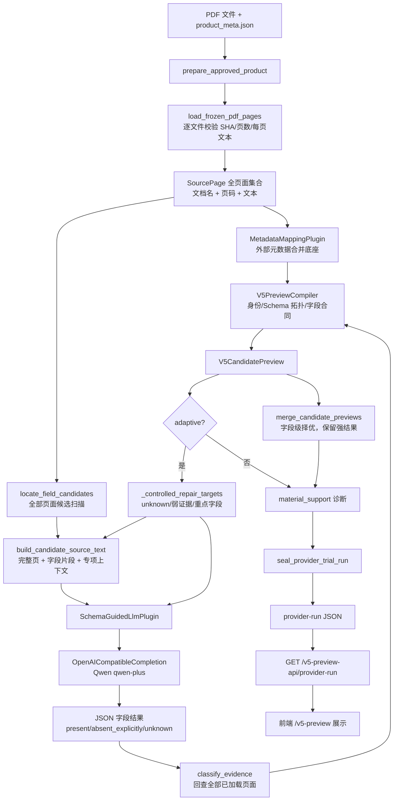

# 当前 Ingest 与抽取架构

> 代码基线：当前 `InsuranceKB-WeKnora-ingest` worktree。
> 本文是代码索引和运行链路说明，不改变业务代码，也不代表已经发布到 Active。

## 1. 先看结论

当前前端 `/v5-preview` 看到的结果，主要来自 `v5_preview` 这条候选预览链路：

1. 后端先校验产品、版本、PDF 文件名、SHA-256、页数和每页文本。
2. 所有 PDF 页面先被解析成带文档名和页码的页面集合。
3. `MetadataMappingPlugin` 读取 `product_meta.json`，只作为字段合并底座；它不是完整抽取结果。
4. 候选扫描器会遍历全部页面，按字段语义和关键词定位候选页；大材料再按预算生成完整页片段和字段片段。
5. `SchemaGuidedLlmPlugin` 按险种对应 Schema 调用 Qwen/兼容 OpenAI 的模型，要求每个字段返回三态、值和逐字 Evidence。
6. Evidence resolver 会回到全部已加载页面做原文匹配，匹配成功才给 `VERIFIED` 或 `NORMALIZED_MATCH`。
7. 自适应模式会把 `unknown`、弱 Evidence 和重点语义字段送入一次定向补抽，再做字段级择优合并。
8. 最后计算材料支持诊断并封存 provider-run JSON；该结果只具有候选预览效果，不产生 serving 或发布权限。

仓库内另有一条通用 `compiler` 编译器链路（LangGraph、断点、重试、补漏、投票和最终化）。它是通用/生产编译能力，当前本地 v5-preview provider trial 不直接经过这条 LangGraph graph；两条链路通过相同的 Schema、Evidence 和来源身份原则保持一致。

## 2. 抽取相关代码模块（相对仓库根目录）

### 2.1 当前 v5-preview 主链路

| 相对路径 | 关键入口/对象 | 作用 |
| --- | --- | --- |
| `harness/src/insurance_harness/v5_preview/api.py:98` | `create_app` | FastAPI 装配；注册 fixture、LLM preview、provider-run 和动态补抽接口 |
| `harness/src/insurance_harness/v5_preview/api.py:137` | `health` | 返回 Schema、LLM、provider-run、动态补抽配置状态 |
| `harness/src/insurance_harness/v5_preview/api.py:150` | `get_provider_run` | 只读加载已封存的 provider-run 结果，前端展示主要走这里 |
| `harness/src/insurance_harness/v5_preview/api.py:163` | `llm_preview` | 单次实时 LLM 预览入口；未配置 provider 时返回 503 |
| `harness/src/insurance_harness/v5_preview/api.py:168` | `dynamic_field_gapfill` | 前端触发动态补抽的后端入口 |
| `harness/src/insurance_harness/v5_preview/catalog.py:78` | `load_v5_catalog` | 加载并校验 v5 Schema、险种拓扑、分类和字段数量 |
| `harness/src/insurance_harness/v5_preview/contracts.py` | `IngestRequest`、`PluginFieldResult`、`V5CandidatePreview` | Ingest、字段、Evidence 和候选预览的闭合数据合同 |
| `harness/src/insurance_harness/v5_preview/ingest.py:44` | `IngestPluginRegistry` | 按 `catalog_id` 注册/解析可插拔 Ingest plugin |
| `harness/src/insurance_harness/v5_preview/ingest.py:124` | `V5PreviewCompiler.compile` | 选择险种 Schema、调用 plugin、校验拓扑和身份、生成候选预览 |
| `harness/src/insurance_harness/v5_preview/ingest.py:190` | `gap_field_ids`、`diagnose_gap_reasons` | 找出 unknown、弱 Evidence，并区分来源没命中、命中未抽取、Evidence 未验证等原因 |
| `harness/src/insurance_harness/v5_preview/ingest.py:289` | `merge_candidate_previews` | 按 Evidence 强度做字段级合并，保护主结果身份和 Schema 拓扑 |
| `harness/src/insurance_harness/v5_preview/provider_trial.py:725` | `load_frozen_pdf_pages` | 读取 PDF 全部页面，校验文件身份、页数和页面文本；可为指定补充材料调用 OCR |
| `harness/src/insurance_harness/v5_preview/provider_trial.py:914` | `prepare_approved_product` | 校验产品目录和 `product_meta.json`，拼装全部基础/补充页面及来源 manifest |
| `harness/src/insurance_harness/v5_preview/provider_trial.py:1032` | `prepare_approved_products` | 批量准备本次允许测试的产品 |
| `harness/src/insurance_harness/v5_preview/provider_trial.py:1238` | `_request_for_product` | 把准备好的产品页面封装成 `IngestRequest` |
| `harness/src/insurance_harness/v5_preview/provider_trial.py:1609` | `run_provider_trial` | provider 试跑总入口，负责产品循环、调用预算、重试/补抽、封存输出 |
| `harness/src/insurance_harness/v5_preview/provider_trial.py:1424` | `_run_controlled_product` | 受控微批模式：按字段组调用模型，再做定向补抽 |
| `harness/src/insurance_harness/v5_preview/provider_trial.py:1220` | `_review_error_code` | 将未验证 Evidence 或剩余 unknown 转为审核状态 |
| `harness/src/insurance_harness/v5_preview/provider_trial.py:1068` | `seal_provider_trial_run` | 生成运行摘要、调用回执、哈希和 `serving_effect=NONE` |
| `harness/src/insurance_harness/v5_preview/provider_trial.py:1116` | `write_provider_trial_run` | 把候选结果写入本地 JSON |

### 2.2 候选召回、上下文和字段约束

| 相对路径 | 关键入口/对象 | 作用 |
| --- | --- | --- |
| `harness/src/insurance_harness/v5_preview/dynamic_ingest.py:267` | `locate_field_candidates` | 对指定字段扫描全部页面，按字段显示名、同义语义、来源提示计算候选分数 |
| `harness/src/insurance_harness/v5_preview/dynamic_ingest.py:621` | `select_candidate_source` | 先完成全页扫描，再选择有限完整页，并为未入选候选页保留字段中心片段 |
| `harness/src/insurance_harness/v5_preview/dynamic_ingest.py:315` | `build_candidate_source_text` | 组装模型上下文；普通字段走候选页，`保什么` 和重点字段增加专项/全材料上下文 |
| `harness/src/insurance_harness/v5_preview/dynamic_ingest.py:382` | `build_full_material_field_source_text` | 为宽限期、险种转换、费率可调、产品简介、产品概览等字段生成有页码标记的全材料上下文 |
| `harness/src/insurance_harness/v5_preview/dynamic_ingest.py:482` | `build_coverage_summary_source_text` | 对“保什么”按责任语义跨文档召回，并保留邻页和被预算裁剪页面的片段 |
| `harness/src/insurance_harness/v5_preview/dynamic_ingest.py:783` | `build_field_micro_batches` | 把非纯外部映射字段按字段数拆成有序微批 |
| `harness/src/insurance_harness/v5_preview/dynamic_ingest.py:921` | `MetadataMappingPlugin` | 读取 `product_meta.json`；缺少险种简称时，还会在页面文本中做候选发现 |
| `harness/src/insurance_harness/v5_preview/value_constraints.py:62` | `parse_value_guidance` | 解析 XLSX 导入的取值说明、枚举、布尔和格式约束 |
| `harness/src/insurance_harness/v5_preview/value_constraints.py:169` | `normalize_field_value` | 对模型返回值做约束内归一化；无法安全归一化时保留原始表达或进入审核 |
| `harness/src/insurance_harness/v5_preview/material_support.py:141` | `classify_material_support` | 只做材料是否支持字段的诊断，不替模型决定字段值 |
| `harness/src/insurance_harness/v5_preview/material_support.py:256` | `compute_material_supported_extraction_rate` | 计算材料支持条件下的 `present ∧ supported / supported` |

### 2.3 LLM、Evidence 和动态补抽

| 相对路径 | 关键入口/对象 | 作用 |
| --- | --- | --- |
| `harness/src/insurance_harness/v5_preview/llm_plugin.py:45` | `OpenAICompatibleCompletion` | 统一 Qwen/兼容 OpenAI 接口，记录调用次数、响应回执和 token 信息 |
| `harness/src/insurance_harness/v5_preview/llm_plugin.py:323` | `SchemaGuidedLlmPlugin` | 把 Schema、取值说明、来源文本和任务提示发给 LLM，解析闭合 JSON 并调用 Evidence resolver |
| `harness/src/insurance_harness/v5_preview/provider_trial.py:843` | `classify_evidence` | 在全部页面中做逐字匹配和去空白归一化匹配，返回 Evidence 状态 |
| `harness/src/insurance_harness/v5_preview/dynamic_gapfill.py:190` | `SchemaGuidedDynamicFieldExecutor` | 复用 SchemaGuided LLM plugin，仅抽指定字段 |
| `harness/src/insurance_harness/v5_preview/dynamic_gapfill.py:340` | `_context_plan` | 动态补抽的上下文规划，支持 `matched_snippets`、`adjacent_pages`、`all_material` |
| `harness/src/insurance_harness/v5_preview/dynamic_gapfill.py:440` | `DynamicFieldGapfillService` | 校验预览哈希、字段状态和材料身份，最多三段范围逐步补抽并合并结果 |

### 2.4 通用 compiler 链路（与当前 v5-preview provider trial 分开）

| 相对路径 | 关键入口/对象 | 作用 |
| --- | --- | --- |
| `harness/src/insurance_harness/compiler/pipeline.py` | `PipelineConfig`、LangGraph pipeline | 通用状态图：`load → split_route → extract → gapfill → vote → finalize`，带 checkpoint、重试和死信 |
| `harness/src/insurance_harness/compiler/native_pdfplumber.py` | PDF 原生解析适配器 | 从 PDF 生成页面/来源文本 |
| `harness/src/insurance_harness/compiler/native_mineru_cloud.py` | MinerU 云解析适配器 | 可插拔的云端解析路径 |
| `harness/src/insurance_harness/compiler/parsed_documents.py` | 解析制品合同 | 统一不同解析器输出 |
| `harness/src/insurance_harness/compiler/sections.py` | `split_sections`、`route_groups` | 章节切分、字段组路由和产品族指纹 |
| `harness/src/insurance_harness/compiler/extract.py` | `WindowExtractor`、`build_windows` | 按窗口和字段组调用模型，处理传输重试 |
| `harness/src/insurance_harness/compiler/gapfill.py` | `gapfill_eligibility`、`gapfill_field` | 对缺失候选做有预算的补漏 |
| `harness/src/insurance_harness/compiler/semantic_resolution.py` | `resolve_candidates` | 跨窗口/跨页面语义消歧和候选解析 |
| `harness/src/insurance_harness/compiler/evidence_verifier.py` | Evidence 校验/修复 | 对候选 Evidence 做结构化核验和修复 |
| `harness/src/insurance_harness/compiler/verification.py` | `quote_verified` | 判断引文是否能在来源中逐字验证 |
| `harness/src/insurance_harness/compiler/voting.py` | `vote_field` | 多候选字段投票和择优 |
| `harness/src/insurance_harness/compiler/llm.py` | `ModelClient`、`MeteredClient` | 通用模型边界、调用计量和生产入口控制 |
| `harness/src/insurance_harness/compiler/extraction_tasks.py` | 抽取任务合同 | durable task、attempt 和失败状态 |
| `harness/src/insurance_harness/compiler/extraction_receipts.py` | 抽取回执 | 记录模型、提示词、字段组和调用结果 |
| `harness/src/insurance_harness/sources/` | 来源协议、目录和 WeKnora source | 通用来源生命周期和来源身份；不是当前 v5-preview JSON 试跑的直接入口 |

## 3. 当前 v5-preview 实际架构图



### 3.1 这张图里“规则”和“LLM”的边界

- 规则负责候选召回、来源身份校验、Schema/字段顺序校验、取值归一化和 Evidence 原文核验。
- `product_meta.json` 的映射是外部来源字段的合并底座；它不会把其他 PDF 字段自动填满。
- LLM 负责在传入的 Schema 和候选材料中选择字段值、识别三态、做有材料约束的简介/概览总结，并返回逐字 Evidence。
- LLM 输出必须先通过 `SchemaGuidedLlmPlugin` 的闭合 JSON 校验，再由 `V5PreviewCompiler` 和 Evidence resolver 接纳。
- Evidence 未验证不会把页面结果静默变成事实；它会保留在候选预览中并标记为审核需要，或由后续定向补抽继续尝试。

## 4. 抽取层调用链路

### 4.1 生成 provider-run（离线/测试）

```text
provider_trial_main()
  -> run_provider_trial()
     -> prepare_approved_products()
        -> prepare_approved_product()
           -> load_frozen_pdf_pages()                 # 每个 PDF 的全部页面
           -> build_source_text()                     # 小材料：全页文本
           -> build_candidate_source_text()           # 超预算：全页扫描后限量上下文
     -> 对每个产品循环
        -> _request_for_product()
        -> _compiler(MetadataMappingPlugin(...)).compile()
        -> locate_field_candidates()                  # 全页候选召回
        -> for attempt in max_product_attempts
           -> build_candidate_source_text()           # 首轮或定向字段上下文
           -> _request_for_product(source_text=...)
           -> SchemaGuidedLlmPlugin.extract()
              -> _schema_prompt()                     # Schema/取值说明/上下文
              -> OpenAICompatibleCompletion.complete()
                 -> POST /chat/completions            # Qwen qwen-plus
              -> JSON topology/state/value/evidence 校验
              -> normalize_field_value()
              -> classify_evidence()                  # quote 回查全部页面
           -> V5PreviewCompiler.compile()
              -> _select_insurance_class()
              -> plugin.extract()
              -> _validate_plugin_result()
              -> CandidateField / V5CandidatePreview
           -> merge_candidate_previews()
           -> _controlled_repair_targets()             # 首轮后选择补抽字段
     -> _review_error_code()
     -> classify_material_support()
     -> compute_material_supported_extraction_rate()
     -> seal_provider_trial_run()
     -> write_provider_trial_run()
```

### 4.2 前端打开结果页面

```text
浏览器 /v5-preview
  -> 前端请求 GET /v5-preview-api/provider-run
  -> api.create_app() 启动时读取 V5_PREVIEW_RUN_ARTIFACT
  -> load_provider_trial_run()
     -> 校验 run_sha256、catalog_sha256、preview_sha256
  -> 返回封存的 V5ProviderTrialRun
  -> 前端按 insurance_class、categories、fields、evidence 渲染
```

这里的页面刷新只是读结果，不会再次调用 LLM。要实时调用模型，走 `POST /v5-preview-api/preview`；要补抽某些字段，走 `POST /v5-preview-api/dynamic-field-gapfill`。

### 4.3 前端点击动态补抽

```text
前端按钮
  -> POST /v5-preview-api/dynamic-field-gapfill
     {product_version_id, preview_sha256, action, field_ids}
  -> DynamicFieldGapfillService.run()
     -> 校验预览哈希、catalog/schema、字段当前状态、材料版本
     -> scope=matched_snippets
        -> _context_plan() -> locate_field_candidates() -> LLM
     -> scope=adjacent_pages（仍未改善时）
        -> 邻页上下文 -> LLM
     -> scope=all_material（仍未改善时）
        -> 全部页面上下文 -> LLM
     -> 每阶段校验字段顺序、Evidence 来源身份和值变化
     -> 仅接受更强 Evidence 或明确改善
  -> 返回 DynamicFieldGapfillResponse
     -> serving_effect=NONE，review_publish_admission=false
```

## 5. 通用 compiler 的调用链路（用于后续接 WeKnora ingest）

通用链路的核心是状态图，适合做可恢复、可重试的长期 ingest：

```text
source adapter / WeKnora source
  -> load
     -> feedability 检查与输入隔离
  -> split_route
     -> sections.split_sections() / route_groups()
  -> extract
     -> build_windows()
     -> WindowExtractor
     -> LLM ModelClient（仅在节点内部）
     -> quote_verified / evidence verifier
  -> gapfill
     -> gapfill_eligibility()
     -> gapfill_field()（有调用预算）
  -> vote
     -> semantic_resolution.resolve_candidates()
     -> voting.vote_field()
  -> finalize
     -> manifest、receipt、checkpoint 和最终候选状态
```

`compiler/pipeline.py` 的 LangGraph 状态图和 `v5_preview/ingest.py` 的 plugin registry 是两个不同层次的可插拔点：前者替换/编排整条编译流程，后者替换同一个 v5 Schema 合同下的字段抽取实现。

## 6. 字段状态和审核状态

### 字段输出三态

| 状态 | 含义 | Evidence 要求 |
| --- | --- | --- |
| `present` | 材料支持并给出了字段值 | 必须有 value 和至少一条 Evidence |
| `absent_explicitly` | 原文明确说明不适用/不存在 | value 为 null，但必须有 Evidence |
| `unknown` | 当前上下文不能可靠确定 | value 和 Evidence 都为空 |

### Evidence 状态

代码使用的强度顺序是：

`UNRESOLVED < AMBIGUOUS < NORMALIZED_MATCH < VERIFIED`

- `VERIFIED`：引文在唯一页面逐字出现。
- `NORMALIZED_MATCH`：去空白、Unicode 归一化后匹配。
- `AMBIGUOUS`：引文出现在多个页面，模型给的页码不足以唯一定位。
- `UNRESOLVED`：未在加载的页面中找到引文。

### 产品/运行状态

`SUCCESS` 表示候选结果没有触发当前审核错误；`REVIEW_REQUIRED` 表示存在未验证 Evidence 或 unknown；`FAILED` 表示 provider/合同/来源校验等导致没有可接受预览。所有 v5-preview 结果固定为 `serving_effect=NONE`、`review_publish_admission=false`。

## 7. 一次请求到底扫描多少材料

这里要区分“扫描”和“送进模型”：

- PDF 解析阶段：`load_frozen_pdf_pages` 读取每个 PDF 的全部页面，并保留页码。
- 候选阶段：`locate_field_candidates` 对全部页面做字段语义扫描，先形成候选覆盖记录。
- 模型上下文阶段：为了控制 token，可能只送部分完整页和片段。普通字段由候选页排序；未入选候选页仍会追加字段中心片段。
- 重点字段（宽限期、险种转换、费率可调、产品简介、产品概览）通过 `build_full_material_field_source_text` 走全材料有序上下文，但超出预算时每页保留有标记的头尾片段。
- `保什么` 通过跨文档责任语义召回，并为被预算裁剪的命中页保留补充片段。
- Evidence 回查阶段仍在全部已加载页面中匹配，不只查送进模型的片段。

因此，“全部 PDF”与“PDF 全部页面”在当前代码中不是同一概念：文件集合由产品批准清单决定；清单内每个 PDF 的页面都先解析和扫描，但模型上下文会受字符/调用预算限制。

## 8. 后续排查入口

遇到字段为空，建议按下面顺序查：

1. 看 `CandidateCoverage.scanned_page_count` 和 `candidate_page_count`：确认材料是否被扫描到、是否有候选页。
2. 看 `diagnose_gap_reasons`：区分 `source_not_found`、`source_found_not_extracted` 和 `evidence_unverified`。
3. 看 provider-run 的 `attempts`：确认是否真正发起过首轮和定向补抽调用。
4. 看 Evidence 的 locator、quote 和 verification status：很多“有值但没展示”实际是引文页码不唯一或引文不在当前来源版本。
5. 看 `material_support_metrics`：它只回答“材料支持条件下的抽取率”，不等同于事实准确率。
6. 最后再看 Schema 的 `formation_modes` 和 XLSX `value_guidance`：纯外部映射、纯 LLM 生成字段与 PDF 可抽字段的统计口径不同。

## 9. 手动启动说明

面向使用者的启动命令已独立整理，见 [43-manual-service-startup.md](43-manual-service-startup.md)。本文件只保留抽取架构、调用链路和排查信息。
