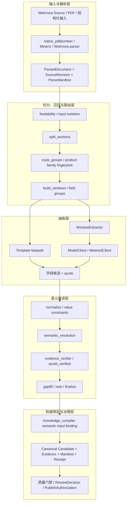
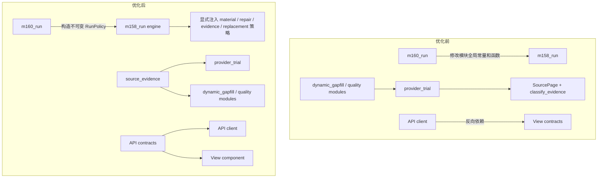

# v5-preview 结构调整与主线合入说明

日期：2026-09-15
状态：本地独立开发，结构优化已完成并通过验证
用途：说明这次改了哪些代码、抽取链路有没有变化，以及后续怎么合入原项目

## 1. 这次改了什么

代码已经改过，但这次只处理结构和代码规范，没有调整抽取策略。字段召回、LLM 提示词、Evidence 判定、质量门禁、调用预算和输出格式都保持原样。

主要改了三处：

1. `m160_run.py` 不再通过 `cast(Any)` 修改 `m158_run.py` 的模块全局变量和函数，改为构造不可变的 `M158RunPolicy` 并显式传入执行引擎。
2. `SourcePage` 与 `classify_evidence` 从大型 `provider_trial.py` 中拆到独立的 `source_evidence.py`，由 provider、gapfill 和质量模块共同依赖。
3. 前端 v5 合同从页面目录迁移到 API 目录，修正了“API 层反向依赖 View 层”的依赖方向；三个合同文件只移动位置，内容未变。

直接收益是不同试跑之间不会互相污染，公共逻辑更容易测试和复用，类型检查也已经通过。由于没有重跑真实模型，本次不能用来证明抽取准确率或字段详实度有变化。

阅读顺序：了解系统先看第 3、4 节；核对改动文件看第 5 至 8 节；准备合入主线看第 12 节。

## 2. 仓库与代码身份

实际改动仓库：

```text
D:/pa code/pythonproject/InsuranceKB-WeKnora-ingest
```

当前身份：

| 项目 | 当前值 |
| --- | --- |
| 分支 | `codex/local-v5-preview` |
| v5 功能基线 | `72c446eb` (`feat: add v5 insurance extraction preview`) |
| 结构优化提交 | `6d1fb981` (`refactor: isolate v5 preview modules`) |
| 个人远端 | `personal/main` 已包含结构优化提交 |
| 原项目基线 | `origin/main@d2ce44cb` |

另一个目录 `D:/pa code/pythonproject/insurance weknora wiki xg` 当前是原项目工作区，位于 `main@dfa87e11`，其中没有本轮 `v5_preview` 优化代码。该目录已有的 Go/DI 未提交修改不是本轮工作，不能与本文所列变更混为一组。

## 3. 项目架构

### 3.1 模块边界

项目主体是 Enterprise LLM Wiki，保险抽取是其中的编译环节。各模块分工如下：

- WeKnora 负责上传、解析、来源生命周期、权限、检索、Wiki 载体以及唯一 serving Active Head。
- Python Harness 负责保险语义抽取、编译、Candidate、Evidence、质量治理、审核决策和发布授权。
- Go Schema Wiki API 负责现有 current/pinned 读取、ACL、Head/CAS、引用读取和服务装配。
- Vue Schema Wiki 负责正式知识展示与引用查看。
- Harness 可保存不可变 Candidate、决策和回执，但不能保存第二个 serving Active Head。
- `v5_preview` 只是一条本地实验验证链，输出固定为 `serving_effect=NONE`，不能绕过 Candidate/Review/Publish 流程进入正式知识。

主流程如下。图里画的是模块关系，不表示 Release Kernel 已经部署完成：

```mermaid
flowchart LR
    U[PDF / Office / 结构化来源] --> W1[WeKnora 上传与 Source lifecycle]
    W1 --> W2[docreader / OCR / chunk / 原文]
    W2 --> A[WeKnora REST Source Adapter]

    subgraph H[Python Harness：语义编译与治理]
        A --> P[ParsedDocument / SourceRevision / Manifest]
        P --> C[分类、路由、抽取、Evidence 回验与语义编译]
        C --> CE[Candidate + Evidence + Receipt]
        CE --> Q[质量门禁 / Golden Eval]
        Q --> R[ReviewDecision + PublishAuthorization]
        J[(Job Store / Outbox)] --> C
        J --> R
    end

    R --> WP[WeKnora preparation]
    WP --> WA[原子 activation / CAS]
    WA --> AH[WeKnora 唯一 Active Head]
    AH --> G[Go Schema Wiki API<br/>ACL / current-pinned / citation]
    G --> V[Vue Schema Wiki]
    AH --> AG[Agent / RAG / MCP consumer]
    V --> BU[业务用户]
    AG --> BU

    X[v5_preview 本地实验链] -.候选算法与评测输入.-> C
    X -.serving_effect=NONE.-> Z[不得直接发布]
```



### 3.2 代码位置

| 层级 | 主要路径 | 做什么 | 注意事项 |
| --- | --- | --- | --- |
| WeKnora 平台层 | Go 主服务、WeKnora API 与 Wiki | 上传、解析、权限、检索、页面承载、唯一 Active Head | 不承载保险字段语义和第二套编译规则 |
| 来源适配层 | `harness/src/insurance_harness/sources/`、`harness/src/insurance_harness/adapters/weknora/` | Source lifecycle、来源身份、WeKnora REST 适配 | 不直读 WeKnora DB/Redis/Asynq |
| 通用解析与抽取层 | `harness/src/insurance_harness/compiler/` | ParsedDocument、章节切分、路由、窗口抽取、补漏、Evidence、语义消歧、投票、finalize、checkpoint | 是长期 ingest 的通用状态图，不等同于 v5 provider trial |
| 正式知识编译权威 | `harness/src/insurance_harness/knowledge_compiler/` | canonical Candidate/Evidence、revision、manifest、review/release handoff | 不持有第二个 serving Head |
| 本地实验验证层 | `harness/src/insurance_harness/v5_preview/` | Schema v5 抽取实验、候选召回、业务字段质量规则、provider trial、动态补抽 | `serving_effect=NONE`，不能原样变成第二条生产链 |
| Go Schema Wiki 读取层 | `internal/application/repository/schema_wiki_formal_candidate_preview.go`、`internal/application/repository/wiki_release.go`、`internal/application/service/schema_wiki*.go`、`internal/handler/schema_wiki.go`、`internal/router/routes_schema_wiki.go` | current/pinned 读取、ACL、Head/CAS、引用和 HTTP 装配 | 应复用现有 route/DTO/service，不新增旁路平台 |
| 正式前端 | `frontend/src/views/knowledge/schema-wiki/`、`frontend/src/components/schema-wiki/` | 正式 Schema Wiki、字段状态和 PDF 引文体验 | 不把 `/v5-preview` 当正式 serving 页面 |
| 实验前端 | `frontend/src/views/knowledge/schema-wiki/v5-preview/` | 本地候选结果检查和动态补抽 | 只用于开发评估 |

## 4. 解析、抽取和编译链路

### 4.1 通用链路



主要调用链为：

```text
source adapter / WeKnora source
  -> load + feedability
  -> split_route
     -> split_sections()
     -> route_groups()
  -> extract
     -> run_fastpath() 或 build_windows() + WindowExtractor
     -> ModelClient / MeteredClient
  -> semantic compile
     -> normalize
     -> resolve_candidates()
     -> evidence verifier / quote_verified()
  -> gapfill + vote + finalize
  -> knowledge_compiler input binding
  -> canonical Candidate / Evidence / Manifest / Receipt
  -> quality / review / publish authorization
```

### 4.2 v5-preview 和通用 compiler 的关系

```mermaid
flowchart LR
    subgraph V5[v5-preview 当前实验链]
        V1[冻结 PDF + product_meta] --> V2[全页解析为 SourcePage]
        V2 --> V3[locate_field_candidates]
        V3 --> V4[完整页 + 片段 + 跨文件上下文]
        V4 --> V5[SchemaGuidedLlmPlugin]
        V5 --> V6[value constraints]
        V6 --> V7[source_evidence 回原文核验]
        V7 --> V8[业务质量门禁 / 定向补抽 / replacement]
        V8 --> V9[V5CandidatePreview + sealed JSON]
        V9 --> V10[FastAPI + /v5-preview]
    end

    subgraph GC[通用 compiler / canonical 方向]
        C1[ParsedDocument] --> C2[split_route + windows]
        C2 --> C3[fastpath / WindowExtractor]
        C3 --> C4[semantic resolution + Evidence]
        C4 --> C5[gapfill + vote + finalize]
        C5 --> C6[knowledge_compiler Candidate / Evidence]
    end

    V3 -.候选召回算法可适配.-> C2
    V4 -.上下文规划可适配.-> C3
    V6 -.字段约束可复用.-> C4
    V7 -.Evidence 能力可复用.-> C4
    V8 -.业务质量规则可接入.-> C5
    V9 -.不能直接作为正式 Candidate.-> C6
```

两条链目前是分开的。`compiler/pipeline.py` 负责可恢复、可重试的长期 ingest；`v5_preview` 用来在本地验证抽取效果。后续应把召回、上下文、Evidence 和质量规则接进 compiler，而不是把 v5 的 FastAPI、JSON runner 和页面一起接到发布链。

### 4.3 关键代码映射

| 阶段 | 通用 compiler | v5-preview 当前实现 | 合入方式 |
| --- | --- | --- | --- |
| PDF/解析合同 | `compiler/native_pdfplumber.py`、`native_mineru_cloud.py`、`parsed_documents.py` | `provider_trial.py`、`SourcePage` | 统一转换到 ParsedDocument/SourceRevision，不新增第三种正式来源合同 |
| 切分与路由 | `compiler/sections.py`、`routing_data.py` | `dynamic_ingest.py::locate_field_candidates` | 将字段召回作为 route/window 的可配置策略 |
| 上下文构建 | `compiler/extract.py::build_windows` | `build_candidate_source_text`、`build_full_material_field_source_text` | 以 context planner 接口接入，不复制整套 runner |
| 模型调用 | `compiler/llm.py` | `v5_preview/llm_plugin.py` | 统一到 ModelClient/MeteredClient，保留 v5 Schema 输出适配器 |
| 值约束 | `compiler/models.py` 与 finalize 合同 | `value_constraints.py`、`field_profiles.py` | 作为字段 profile/normalizer 插件复用 |
| 语义消歧 | `compiler/semantic_resolution.py` | replacement 与业务质量决策 | 必须放在 feature flag 和预算门禁后单独评测 |
| Evidence | `evidence_verifier.py`、`verification.py` | `source_evidence.py` | 保留一个 canonical Evidence contract，迁入通用 verifier 或做 adapter |
| 补漏与择优 | `gapfill.py`、`voting.py` | `dynamic_gapfill.py`、`m160_quality.py` | 把业务 completeness 规则接到既有 gapfill/vote stage |
| 权威输出 | `knowledge_compiler/` | `V5CandidatePreview`、provider-run JSON | 必须重新绑定 canonical Candidate/Evidence；preview 不能直接发布 |

## 5. 这次调整是否改变抽取链路

### 5.1 结论

业务处理顺序没变，变的是模块依赖和运行配置的传递方式。

保持不变的数据流：


发生变化的控制与依赖结构：



### 5.2 具体改动

| 模块 | 代码位置 | 改了什么 | 直接效果 | 对抽取行为的影响 |
| --- | --- | --- | --- | --- |
| 运行策略 | `harness/src/insurance_harness/v5_preview/m158_run.py:157` | 新增冻结的 `M158RunPolicy` 和四个 Protocol | 运行配置显式、可注入、可测试 | 默认策略仍引用原常量与原函数，无预期行为变化 |
| M158 执行入口 | `harness/src/insurance_harness/v5_preview/m158_run.py:452` | `run_m158(..., policy=None)`，内部使用 `effective_policy` | 同一进程内不同运行不再依赖外部改写全局状态 | 调用次序、批次、预算、合并逻辑不变 |
| M160 编排 | `harness/src/insurance_harness/v5_preview/m160_run.py:89`、`:117` | 删除 `_base`、`cast(Any)` 和全局 monkey patch | 消除并发、测试顺序和重复运行污染风险 | 仍使用原 M160 loader、repair、admit、replacement 函数 |
| Evidence 公共模块 | `harness/src/insurance_harness/v5_preview/source_evidence.py:14`、`:45` | 独立承载 `SourcePage` 和 `classify_evidence` | 降低 provider orchestration 与 Evidence 解析的耦合 | 判定实现为原代码等价迁移 |
| Provider 兼容层 | `harness/src/insurance_harness/v5_preview/provider_trial.py:53`、`:1951` | 从公共模块导入并继续在 `__all__` 中导出 | 旧导入路径继续可用 | 无合同变化 |
| 前端合同归属 | `frontend/src/api/schema-wiki/v5/` | 三个合同从 View 目录移动到 API 目录 | API 层不再依赖页面实现 | 解析器及类型内容未改变 |
| 本地产物隔离 | `.gitignore:32` | 忽略输出 JSON、`outputs/` 和本地归档 | 防止评测产物混入源码提交 | 无运行行为变化 |

## 6. 后端代码变更清单

以下是本轮所有 Python 源码和测试路径。

### 6.1 运行编排与依赖注入

| 路径 | 类型 | 说明 |
| --- | --- | --- |
| `harness/src/insurance_harness/v5_preview/m158_run.py` | 修改 | 增加策略 Protocol、`M158RunPolicy`，并把 loader、repair hint、Evidence admission、replacement selection 与冻结身份改为显式策略依赖 |
| `harness/src/insurance_harness/v5_preview/m160_run.py` | 修改 | 删除对 `m158_run` 全局状态的动态改写，构建本次运行专属 policy 后调用 `run_m158` |
| `harness/tests/test_v5_m160_business_priority_completeness.py` | 修改 | monkeypatch 新的显式入口，并断言 M160 policy 的 label 与字段范围 |

### 6.2 Evidence 模块拆分

| 路径 | 类型 | 说明 |
| --- | --- | --- |
| `harness/src/insurance_harness/v5_preview/source_evidence.py` | 新增 | 公共 `SourcePage` 模型和 Evidence exact/normalized/ambiguous/unresolved 分类 |
| `harness/src/insurance_harness/v5_preview/provider_trial.py` | 修改 | 删除重复定义，改为从 `source_evidence` 导入；保留兼容导出 |
| `harness/src/insurance_harness/v5_preview/dynamic_gapfill.py` | 修改 | 直接依赖公共 Evidence 模块，移除运行期从 `provider_trial` 懒导入 |
| `harness/src/insurance_harness/v5_preview/m152_gapfill.py` | 修改 | Evidence 类型与分类函数改从公共模块导入 |
| `harness/src/insurance_harness/v5_preview/m156_run.py` | 修改 | Evidence 类型与分类函数改从公共模块导入 |
| `harness/src/insurance_harness/v5_preview/m157_quality.py` | 修改 | Evidence 类型与分类函数改从公共模块导入 |
| `harness/tests/test_v5_business_priority_field_quality.py` | 修改 | 测试改从公共模块导入 `SourcePage` |

### 6.3 类型、lint 与格式闭合

| 路径 | 类型 | 说明 |
| --- | --- | --- |
| `harness/src/insurance_harness/v5_preview/business_field_quality.py` | 修改 | 长签名和正则格式化，不改逻辑 |
| `harness/src/insurance_harness/v5_preview/field_profiles.py` | 修改 | 报销范围提示字符串分行；拼接后的文本内容不变 |
| `harness/src/insurance_harness/v5_preview/llm_plugin.py` | 修改 | 在 `present` 分支增加静态类型收窄 cast；cast 为运行时无操作 |
| `harness/src/insurance_harness/v5_preview/m160_quality.py` | 修改 | 对已由状态分支保证非空的值增加类型收窄 cast |
| `harness/src/insurance_harness/v5_preview/ocr.py` | 修改 | 给固定 OCR 模型名增加 `Literal` 标注 |
| `harness/src/insurance_harness/v5_preview/value_constraints.py` | 修改 | 收紧函数类型签名以符合实际调用合同；函数体不变 |

## 7. 前端代码变更清单

### 7.1 合同文件迁移

| 原路径（删除） | 新路径（新增） | 内容校验 |
| --- | --- | --- |
| `frontend/src/views/knowledge/schema-wiki/v5-preview/v5PreviewContract.ts` | `frontend/src/api/schema-wiki/v5/v5PreviewContract.ts` | Git blob 相同：`59c03a51...` |
| `frontend/src/views/knowledge/schema-wiki/v5-preview/v5ProviderTrialContract.ts` | `frontend/src/api/schema-wiki/v5/v5ProviderTrialContract.ts` | Git blob 相同：`0b032b78...` |
| `frontend/src/views/knowledge/schema-wiki/v5-preview/v5DynamicGapfillContract.ts` | `frontend/src/api/schema-wiki/v5/v5DynamicGapfillContract.ts` | Git blob 相同：`8e730d51...` |

这三个文件是纯路径迁移，不是合同重写。

### 7.2 导入路径调整

| 路径 | 类型 | 说明 |
| --- | --- | --- |
| `frontend/src/api/schema-wiki/v5Preview.ts` | 修改 | API client 改为依赖同层 `v5/` 合同 |
| `frontend/src/views/knowledge/schema-wiki/v5-preview/V5SchemaPreview.vue` | 修改 | 页面改从 API 层导入合同类型 |
| `frontend/src/views/knowledge/schema-wiki/v5-preview/V5SchemaPreview.dynamic-gapfill.spec.ts` | 修改 | 更新合同导入路径 |
| `frontend/src/views/knowledge/schema-wiki/v5-preview/V5SchemaPreview.test.ts` | 修改 | 更新合同导入路径 |
| `frontend/src/views/knowledge/schema-wiki/v5-preview/v5DynamicGapfillContract.spec.ts` | 修改 | 更新合同导入路径 |
| `frontend/src/views/knowledge/schema-wiki/v5-preview/v5PreviewContract.test.ts` | 修改 | 更新合同导入路径 |
| `frontend/src/views/knowledge/schema-wiki/v5-preview/v5ProviderTrialContract.test.ts` | 修改 | 更新合同导入路径 |

## 8. 配置与文档变更清单

| 路径 | 类型 | 说明 |
| --- | --- | --- |
| `.gitignore` | 修改 | 增加本地抽取输出与归档忽略规则 |
| `docs/insurance-kb/30-m137-extraction-comparison.md` | 修改 | 仅清理 Markdown 行尾空格 |
| `docs/insurance-kb/31-m138-extraction-comparison.md` | 修改 | 仅清理 Markdown 行尾空格 |
| `docs/insurance-kb/32-m139-nine-product-extraction.md` | 修改 | 仅清理 Markdown 行尾空格 |
| `docs/insurance-kb/33-m140-coverage-summary-semantic-recall.md` | 修改 | 仅清理 Markdown 行尾空格 |
| `docs/insurance-kb/47-m152-eight-product-dynamic-gapfill.md` | 修改 | 仅清理文件尾空行 |
| `openspec/changes/153-business-badcase-regression-table-aware-performance/proposal.md` | 修改 | 仅清理文件尾空行 |
| `docs/insurance-kb/48-v5-preview-structure-refactor-handoff.md` | 新增 | 本交底文档 |

## 9. 本次没有改的内容

本轮没有修改以下业务能力：

- 字段候选页召回与跨文件材料选择；
- 等待期、责任免除、报销范围、外购药/特药责任、理赔材料、保单权益和增值服务的抽取规则；
- Schema Guided LLM 的业务提示语义；
- 三态抽取合同和字段值合同；
- Evidence exact/normalized/ambiguous/unresolved 判定逻辑；
- M158/M160 的字段质量门禁、replacement 策略和补抽规则；
- provider 模型、endpoint、调用预算、并发度和降级路径；
- 运行 JSON、审计 JSON、业务评估 JSON 的合同结构；
- `/v5-preview` 页面展示行为；
- Go API、数据库 schema、migration、Active Head 或发布链。

这次解决的是代码稳定性，不是抽取质量。如果需要确认重构前后模型输出是否一致，要用同一批材料、同一模型和同一参数重跑，再做字段级 diff。本轮没有调用付费 provider。

## 10. 验证结果

在本轮结构优化完成后已执行：

| 验证项 | 结果 |
| --- | --- |
| `ruff check .` | PASS |
| v5-preview 严格 mypy（28 个源码文件） | PASS，0 issue |
| v5 Python 测试 | 99 PASS；其中 1 个先受 Windows 全局临时目录权限影响，改用仓库内 `basetemp` 后 PASS |
| 前端 `type-check` | PASS |
| 前端 v5 组件测试 | 4 PASS |
| 前端 Node 合同测试 | 10 PASS |
| 前端 dynamic contract 测试 | 2 PASS |
| 前端生产构建 | PASS；保留原有 chunk-size warning |
| `git diff --check` | PASS |
| 真实 provider / LLM 重跑 | NOT RUN |

补充验证中，compiler semantic/fastpath 测试为 8 PASS、2 FAIL；两个失败都发生在原实现直接使用 POSIX 专属的 `os.O_DIRECTORY` / `os.O_NOFOLLOW`，属于 Windows 平台兼容问题，不是本轮 v5 重构产生的断言回归。

## 11. 还没解决的问题

这次没有处理以下问题：

1. `v5_preview` 仍是独立实验验证链，不是原 canonical compiler 的正式组成部分。
2. `provider_trial.py`、`m152_gapfill.py` 等文件仍较大，任务编号、产品身份和 frozen SHA 仍进入长期源码。
3. v5 仍拥有独立 FastAPI/前端预览运行链，不能整套原样升级为第二条生产 serving 链。
4. 原 compiler fastpath 的 LLM semantic resolution 行为是否进入生产，需要独立开关、成本/时延评测和降级验证；本轮未处理。
5. 结构优化已推送到个人仓库，但尚未将通用能力迁入 canonical compiler。

## 12. 合入主线评估

### 12.1 结论

从 Git 冲突看，代码不难合；从架构看，不能整套搬进主线。

| 方式 | 难度 | 说明 |
| --- | --- | --- |
| 处理 Git 冲突 | 中低 | v5 大部分是新增目录，和原代码的文本冲突不多 |
| 整套 v5-preview 搬入主线 | 高，不建议 | 会多出一套解析合同、编排、API、页面和运行产物链 |
| 拆出算法和规则后合入 | 中低，可行 | 召回、上下文、Evidence、字段 profile 和质量门禁都有现成的 compiler stage 可接 |
| 保证抽取结果不回退 | 中 | 要用固定材料、同一模型和同一参数做重构前后对比，单元测试不够 |
| 达到生产合入标准 | 中高 | 还要处理配置外置、canonical contract、预算、降级、持久任务和发布边界 |

结论是：按模块拆开后比较好合，整套搬过去不合适。这次结构调整已经把几个公共能力拆了出来，但 v5 实验链和正式主链仍然是两套编排。

### 12.2 各模块怎么处理

| 模块 | 复用价值 | 合入难度 | 处理方式 |
| --- | --- | --- | --- |
| `source_evidence.py` | 高 | 低 | 优先迁入/适配通用 Evidence verifier，并统一 canonical Evidence 状态 |
| `field_profiles.py`、`business_field_quality.py` | 高 | 低到中 | 作为字段 profile 和 completeness policy 接入，不把产品常量写入 pipeline |
| `value_constraints.py` | 高 | 低到中 | 作为 schema normalizer 复用，补齐 canonical CandidateValue adapter |
| `dynamic_ingest.py` 候选召回与上下文 | 高 | 中 | 拆成 recall/context planner，接到 `sections`、`route_groups` 和 `build_windows` |
| `dynamic_gapfill.py` | 中高 | 中 | 把多阶段上下文扩展和改善判定接入既有 `gapfill`，复用任务预算与 receipt |
| `llm_plugin.py` | 中 | 中 | 保留 Schema 输出解析，模型调用统一走 `compiler/llm.py`，避免第二套 provider client |
| `m158_run.py` / `m160_run.py` | 本地评测高、生产低 | 中到高 | 保留为实验 runner 或改成配置驱动评测工具，不作为生产 pipeline stage |
| v5 FastAPI 与 `/v5-preview` 页面 | 本地评估高、生产低 | 高 | 不进入正式路由；需要的展示能力应扩展现有 Schema Wiki 页面 |
| frozen 产品/SHA/任务编号模块 | 审计价值高、通用价值低 | 高 | 外置为版本化 eval manifest，不继续固化在长期业务源码中 |

### 12.3 需要单独处理的改动

相对 `origin/main@d2ce44cb`，当前 v5 功能基线已经修改通用 compiler 的以下文件：

- `harness/src/insurance_harness/compiler/llm.py`
- `harness/src/insurance_harness/compiler/models.py`
- `harness/src/insurance_harness/compiler/pipeline.py`
- `harness/src/insurance_harness/compiler/prompts/__init__.py`
- `harness/src/insurance_harness/compiler/semantic_resolution.py`（新增）

需要重点看 `compiler/pipeline.py:787`：原 fastpath 候选现在会进入 LLM `resolve_candidates()`。这会影响 fastpath 的确定性、成本、耗时、provider 依赖和失败降级。它不是这次结构重构产生的改动，但已经存在于 v5 分支，不能和普通目录迁移一起合入。

semantic resolution 应单独处理：

1. 增加明确 feature flag 和 capability/config binding，默认保持原 fastpath 行为。
2. 冻结字段范围、provider/model、调用预算、超时和失败降级语义。
3. 分别测量准确率、详实度、Evidence 通过率、时延和调用成本。
4. provider 不可用时必须确定性回落，不得让原 fastpath 全链失败。
5. 评测通过后再决定进入通用 pipeline，不能由 v5-preview 页面效果直接推导生产适用。

### 12.4 合入顺序

建议按以下顺序做：

1. 先冻结一组代表性 PDF、字段结果、Evidence 和运行参数，建立 before/after 字段级回归。
2. 合入公共 Evidence 与值约束能力，统一 ParsedDocument、SourceRevision、CandidateValue 和 Evidence adapter。
3. 合入字段 profile 与业务 completeness policy，不改变 pipeline 编排。
4. 将候选召回和上下文规划拆成 compiler 的 route/window/context planner 插件。
5. 将定向补抽规则接入现有 gapfill、budget、attempt 和 receipt 体系。
6. 对 semantic resolution 单独开关、单独评测、单独决策。
7. 将正式输出重新绑定 `knowledge_compiler` 的 Candidate/Evidence/Manifest；v5 runner 和页面继续保留为本地评测工具或后续下线。

### 12.5 交接结论

`source_evidence.py`、字段 profile、质量检查和显式 policy 可以优先处理。候选页召回、跨文件上下文和定向补抽需要先适配 compiler 的合同。任务编号 runner、冻结产品/SHA、独立 FastAPI 和完整 `/v5-preview` 页面继续留在本地评测链，不进入正式主线。

代码目前适合继续做本地抽取验证。要进入生产主线，还需要完成 compiler 合流、配置外置、大文件拆分和一次正式 provider 回归。
