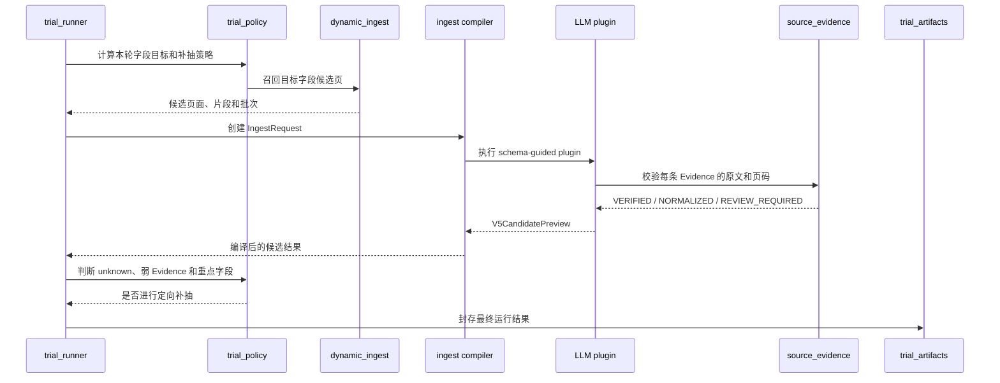
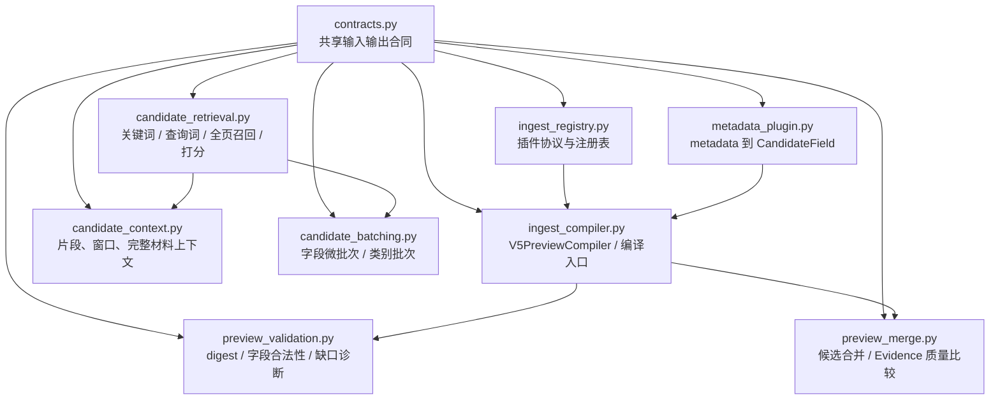

# 抽取阶段架构与 ingest 层模块化方案

## 1. 当前边界

本轮只讨论 Python Harness 的 ingest 层和 V5 抽取链，不涉及 Go API、Vue
页面、数据库、发布流程和 WeKnora serving authority。

当前已经完成的是 V5 预览抽取链的职责拆分。新增文件都位于：

```text
harness/src/insurance_harness/v5_preview/
```

文件名采用 `snake_case`，并使用职责前缀：

- `trial_*`：一次 Provider 试验的运行、策略、合同和产物；
- `material_*`：源材料读取和材料诊断；
- `source_*`：源文件清单和 Evidence；
- `provider_trial.py`：兼容入口和历史导出。

没有新增第二套 API，也没有把 V5 文件放进生产 compiler、Go 服务或前端目录。

当前已拆分的 V5 模块如下：

| 模块 | 主要职责 | 不负责的事情 |
| --- | --- | --- |
| `source_manifest.py` | 冻结产品、PDF、SHA、页数和 schema 拓扑 | 读取 PDF、调用模型 |
| `material_loader.py` | PDF 身份校验、页文本、OCR 补页、Evidence 定位 | 选择字段、编排 Provider |
| `trial_preparation.py` | 产品材料准备、补充材料、材料支持诊断 | 直接发起模型调用 |
| `trial_contracts.py` | Provider、产品结果和运行结果合同 | 选择候选页、构造 prompt |
| `trial_policy.py` | 补抽字段选择、Evidence 状态、内容合成策略 | 文件读写、模型网络调用 |
| `trial_runner.py` | Provider 调用、普通抽取、补抽和运行编排 | CLI 参数解析、产物落盘细节 |
| `trial_artifacts.py` | 运行结果封存、摘要校验、OCR 回执 | 抽取和字段选择 |
| `trial_cli.py` | CLI 参数和运行摘要 | 抽取业务逻辑 |
| `provider_trial.py` | 旧入口、公开导出、试验结果对比 | 新增具体抽取逻辑 |

## 2. 抽取阶段详细流程


一次字段抽取的细节顺序：



这里有两个容易混淆的边界：

1. `dynamic_ingest` 负责“找哪些页面给模型”，不负责最终字段状态裁决。
2. `ingest.py` 负责“把插件结果编译成合法候选”，不负责 PDF 读取和 Provider
   网络调用。

## 3. ingest 层当前状态

V5 预览链的外围编排已经解耦，但 ingest 层本身还保留两个较大的文件：

### `ingest.py`

目前同时包含：

- `V5IngestPlugin` 和 `IngestPluginRegistry`；
- 保险类别选择；
- `V5PreviewCompiler`；
- 插件结果校验和 preview digest；
- 缺口诊断和补抽提示；
- 两次候选 preview 的合并和 Evidence 质量比较。

### `dynamic_ingest.py`

目前同时包含：

- 字段关键词和语义查询词生成；
- 全页候选召回和打分；
- 候选片段截取和上下文拼装；
- 微批次、类别批次生成；
- metadata plugin。

因此，当前结论是：

- V5 试验层：已经完成第一轮模块解耦；
- ingest 层：尚未完成最终拆分，下一轮只在这里做；
- 目前不需要再改 `provider_trial.py` 的职责边界。

## 4. ingest 层建议拆分

下一轮建议按职责拆成以下模块。这里先冻结方向，不改变任何函数行为和公开
导入路径。



推荐的第一批文件职责：

| 建议模块 | 从现有文件迁移的内容 | 依赖方向 |
| --- | --- | --- |
| `ingest_registry.py` | `V5IngestPlugin`、`IngestPluginRegistry` | 只依赖 `contracts.py` |
| `ingest_compiler.py` | `V5PreviewCompiler`、保险类别选择、插件结果校验 | 依赖 registry、contracts、validation |
| `preview_validation.py` | digest、字段诊断、补抽 hint | 只依赖 contracts/catalog |
| `preview_merge.py` | Evidence 质量、`merge_candidate_previews` | 只依赖 contracts |
| `candidate_retrieval.py` | 查询词、候选页、打分、`locate_field_candidates` | 依赖 contracts、field profiles、value constraints |
| `candidate_context.py` | 候选片段、窗口、完整材料上下文 | 依赖 retrieval 输出和 contracts |
| `candidate_batching.py` | `ExtractionBatch`、微批次和类别批次 | 只依赖 schema contracts |
| `metadata_plugin.py` | `MetadataMappingPlugin` | 依赖 contracts 和 source page |

旧路径暂时保留兼容导出：

```python
# ingest.py
from .ingest_compiler import V5PreviewCompiler
from .preview_merge import merge_candidate_previews

__all__ = ["V5PreviewCompiler", "merge_candidate_previews", ...]
```

这样可以先拆物理文件，再逐步更新调用方，不会因为导入路径变化影响现有抽取
结果或测试。

## 5. 两个开发者的并行边界

建议固定为两个开发域，一个共享合同 Owner：

| 开发者 | 负责模块 | 允许修改 | 不直接修改 |
| --- | --- | --- | --- |
| 开发者 A：编译链 | `ingest_registry.py`、`ingest_compiler.py`、`preview_validation.py`、`preview_merge.py` | 插件协议、编译、状态校验、候选合并 | `candidate_retrieval.py`、Provider、前端 |
| 开发者 B：候选链 | `candidate_retrieval.py`、`candidate_context.py`、`candidate_batching.py`、`metadata_plugin.py` | 召回、片段、批次、metadata plugin | 编译器、发布、API |
| 共享合同 | `contracts.py`、`catalog.py` | 先口头对齐，再由指定 Owner 修改 | 两个人同时改同一合同文件 |

开发者 A 和 B 都只能依赖已经冻结的合同。需要增加字段时按以下顺序处理：

1. 先在对齐记录中写清字段名、类型、空值含义和兼容方式；
2. 由共享合同 Owner 修改 `contracts.py`；
3. 两个开发域分别补自己的测试；
4. 保留旧字段或旧导出，不能在同一轮直接改名删除；
5. 最后由集成者跑完整 V5 回归。

## 6. 并行开发流程

```text
冻结 ingest 合同
        ↓
开发者 A / 编译链分支       开发者 B / 候选链分支
        ↓                         ↓
本域单元测试 + strict mypy    本域单元测试 + strict mypy
        ↓                         ↓
分别拉取最新主分支并解决冲突
        ↓
机械合并两个模块域
        ↓
全量 V5 测试 + ruff + mypy + 入口兼容检查
        ↓
比较抽取快照和字段 Evidence 数量
```

每个开发者开始前执行：

```text
1. 拉取最新代码
2. 确认本次只修改自己的模块目录
3. 确认没有改动 prompt、模型、字段规则和输出合同
4. 先补边界测试，再移动实现
```

每个开发者提交前至少验证：

- 本域测试全部通过；
- `ruff check` 通过；
- 目标模块 `mypy --strict` 通过；
- 旧导入路径仍能导入；
- 候选页数量、批次数量、字段顺序和 Evidence 状态没有非预期变化。

集成时再执行完整 V5 测试集。当前基线是 `99 passed`，不能用单域测试通过
替代完整回归。

## 7. 本轮结论

当前模块解耦已经完成了 V5 预览抽取链的第一层，但还没有完成 ingest 层内部
的最终拆分。后续只优化 ingest 层时，建议先拆 `ingest.py`，再拆
`dynamic_ingest.py`；每次只交付一个职责域，并保留旧模块的兼容导出。

这样做的目标是降低多人同时开发的冲突面，而不是改变候选召回、模型抽取或
Evidence 判定效果。
