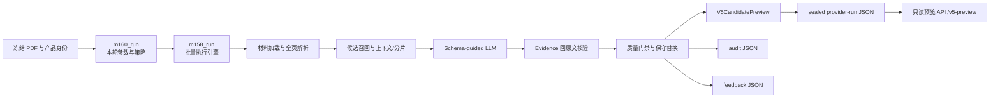

# 当前 V5 Ingest 抽取层：核心模块、入口出口与调用示例

日期：2026-09-22  
适用仓库：`InsuranceKB-WeKnora-ingest`  
适用范围：从已冻结的保险产品材料进入 V5 抽取，到生成本地候选预览、审计和业务反馈评估。

## 0. 先统一本文所说的 Ingest

本文所说的 **Ingest 抽取层**，是已经实际跑出六产品/八产品抽取效果的
`harness/src/insurance_harness/v5_preview/` 链路。它不是以下两部分：

- 不是 WeKnora Go 服务里的文件上传、文档解析、知识库入库接口；那一层负责平台材料接入。
- 不是 `harness/src/insurance_harness/compiler/` 下的通用 LangGraph 编译器；后者是长期的可恢复编译主线，但当前 M160 六产品结果并不是由它直接生成的。

当前需要同时记住两种入口：

1. `V5PreviewCompiler.compile()` 是通用的单产品、单次 Ingest 领域接口。
2. `m160_run.run_m160()` 是最近一次真实六产品效果验证的批量编排入口；它复用
   `m158_run.run_m158()` 执行引擎，并最终生成 provider-run、audit、feedback 三类产物。



### 代码与效果的版本边界

截至本文日期：

- 当前分支 HEAD 为 `b7fa1f18e37e8ecc9d370d59b525c9463c7a2e97`。
- 最后一次有真实 Provider 回执的结果是
  `provider-run-m160-six-products-business-priority.json`，run ID 为
  `v5-trial-d145de09d8cbefea`，run SHA-256 为
  `7a0227bf3f312087cd2b60f3653cc8437b909767000b2bbbbaa99f1c96a4d42c`。
- 该结果覆盖 6 款产品、20 份 PDF、390 个扫描页和 30 次 `qwen-plus` 调用；6 款产品
  均为 `REVIEW_REQUIRED`，`serving_effect=NONE`，不能当作已审核或已发布知识。
- 当前工作区还存在全 Schema、字段质量和批次并发方向的未提交开发修改。这些代码应按
  “当前源码”阅读，但其效果不能由 M160 产物反推；再次声明效果必须重新运行并形成独立回执。

## 1. 需要关注的核心代码模块

建议按下表顺序阅读。前六组构成实际抽取主链，第七组负责输出合同和只读展示。

| 顺序 | 核心模块 | 主要职责 | 阅读重点 |
| --- | --- | --- | --- |
| 1 | `v5_preview/m160_run.py` | 当前批量跑数入口；冻结基线身份、产品范围、字段范围、Provider 和并发参数，构造 `M158RunPolicy` | `run_m160()`、`main()`；它是薄编排层，不是全部抽取逻辑 |
| 2 | `v5_preview/m158_run.py` | 可复用批量执行引擎；规划批次、并发调用 Provider、合并长字段分片、逐字段择优、统计和写产物 | `M158RunPolicy`、`_plan_product_batches()`、`_execute_planned_batches()`、`run_m158()` |
| 3 | `v5_preview/m156_run.py`、`material_loader.py`、`source_manifest.py` | 校验产品/PDF 身份，读取全部页面，保留文档名、页码、SHA、不可读页面和来源版本 | `_load_m156_material()`、`load_frozen_pdf_pages()`；材料身份不一致时应失败，不可静默换材料 |
| 4 | `v5_preview/dynamic_ingest.py`、`m157_quality.py`、`m158_quality.py` | 全页候选召回、字段上下文、长字段分片、覆盖统计和批次规划 | “扫描全部页面”不等于“把全部页面原文一次性送进模型”；模型上下文受字符预算约束 |
| 5 | `v5_preview/llm_plugin.py`、`field_profiles.py`、`value_constraints.py` | 构造 Schema-guided prompt，调用 OpenAI-compatible Provider，校验闭合 JSON，归一化字段值 | `OpenAICompatibleCompletion`、`SchemaGuidedLlmPlugin.extract()`；`present` 必须同时有 value 和 Evidence |
| 6 | `v5_preview/source_evidence.py`、`business_field_quality.py`、`m160_quality.py` | 将 Evidence 回查到原文，检查重点业务字段完整性，并决定候选是否可以替换基线 | `classify_evidence()`、`audit_business_priority_candidate()`、`choose_m160_replacement()`；失败时保留基线，即 fail-closed |
| 7 | `v5_preview/contracts.py`、`trial_contracts.py`、`trial_artifacts.py`、`api.py` | 定义输入/字段/Preview/Run 合同，计算摘要并原子落盘；API 只读加载封存结果 | `IngestRequest`、`V5CandidatePreview`、`V5ProviderTrialRun`、`load_provider_trial_run()`、`GET /v5-preview-api/provider-run` |

当前工作区新增的 `full_schema_quality.py` 及 `m160_run.py` 中 `material_backed` 分支，是把同一执行引擎扩展到更多“原文抽取”字段的开发中能力。它尚未对应新的真实运行产物，阅读时不要把它与已验证的 M160 默认策略混为一谈。

### `ingest.py` 在链路中的准确位置

`v5_preview/ingest.py` 定义的是领域编译边界：

```text
IngestRequest
  -> IngestPluginRegistry.resolve(catalog_id)
  -> plugin.extract(request, schema)
  -> PluginResult 合同/身份/字段拓扑校验
  -> V5CandidatePreview
```

它负责把插件结果编译成合法候选，但不负责读取 PDF、安排多产品并发、管理外部调用预算或写 provider-run 文件。真实六产品跑数的外围编排在 `m160_run.py`/`m158_run.py`。

## 2. 核心模块的入口和出口

| 模块/阶段 | 入口 | 出口 | 关键失败行为 |
| --- | --- | --- | --- |
| `m160_run.run_m160()` | M159 基线文件；三类材料根目录；可选业务反馈表；产品/字段范围；Provider factory；产品和批次并发参数 | `(V5ProviderTrialRun, audit mapping, assessment mapping)`，同时写三份 JSON | 基线摘要、产品 ID、Provider 配置或多产品反馈输入不合法时直接停止 |
| `m158_run.run_m158()` | 已冻结的 baseline、`M158RunPolicy`、材料路径、调用预算和并发 profile | 密封的 run；逐产品/逐调用/逐字段 audit；反馈 assessment | Provider/合同失败计入有界调用；不完整候选不会无条件覆盖基线 |
| 材料加载 | `ProviderTrialProduct.files` 中的文件名/SHA/页数，以及允许的材料根目录 | `M156Material(pages, scanned_page_count, unreadable_page_locators)`；每页带文档名和页码 | 文件缺失、SHA/页数漂移或无法读取时保留明确错误/不可读回执，不伪装成已扫描事实 |
| 批次和上下文规划 | 产品险种、V5 Schema、目标字段、全部 `SourcePage` | 有序 `M158Batch`；包含 field IDs、上下文、候选/已选 locator 和长字段 shard 信息 | 候选召回只用于排序，未命中关键词不能证明字段不存在 |
| `SchemaGuidedLlmPlugin.extract()` | `IngestRequest`、`InsuranceSchema`、本批次字段和材料上下文 | `PluginResult(fields=PluginFieldResult...)`；Provider 层另保留调用 receipt | 非闭合 JSON、字段顺序/类型错误、三态和值/Evidence 不一致时拒绝 |
| Evidence 与质量门禁 | 候选字段、原文上下文、Evidence quote/locator、现有基线值 | `M156FieldDecision`/`M156ReplacementDecision`，以及接纳后的字段或保留的基线 | Evidence 无法定位、原子项不完整或候选退化时 fail-closed，不以“提高抽取率”为理由放宽 |
| `trial_artifacts` | 完成的产品结果、Provider 身份、开始/结束时间 | 带 `run_id`、`run_sha256`、Preview digest 的 `V5ProviderTrialRun`；原子写 JSON | 加载时重新校验 run、catalog 和 preview digest；漂移即拒绝 |
| `api.get_provider_run()` | 环境变量/参数指定的封存 artifact | HTTP 返回 `V5ProviderTrialRun` | 页面刷新只读结果，不触发模型；未配置 artifact 返回 404 |

### 顶层输入

一次真实批量抽取需要五类输入：

1. **冻结基线**：例如 M159 provider-run，用于保守替换和结果身份绑定。
2. **产品材料**：批准范围内的 PDF 根目录；文件名、SHA-256 和页数必须与产品回执一致。
3. **Schema**：`insurance-product-schema-v5`，按险种决定字段集合、顺序、类型和形成方式。
4. **运行策略**：产品 IDs、重点字段、长字段/紧凑字段批次、并发度和最大调用数。
5. **Provider 配置**：当前已验证链使用百炼兼容 endpoint 与 `qwen-plus`；密钥只从环境变量读取。

### 顶层输出

| 产物 | 内容 | 是否可发布 |
| --- | --- | --- |
| `provider-run-*.json` | 运行身份、Provider 回执、产品状态、各产品 `V5CandidatePreview`、字段值和 Evidence | 否 |
| `provider-run-*.audit.json` | baseline/result 摘要、调用预算、性能、材料页数、逐调用和逐字段 replacement 决策 | 否 |
| `provider-run-*.feedback.json` | 业务反馈问题的 `RESOLVED/PARTIAL/UNRESOLVED/NOT_SCORABLE` 评估 | 否 |

这些产物固定 `serving_effect=NONE`、`review_publish_admission=false`。它们是评测和人工复核输入，不是 Candidate Review、PublishAuthorization 或 Active Release。

## 3. 核心模块调用示例及返回结果

### 3.1 调用示例：M160 批量抽取入口

下面示例展示 `m160_run` 的实际 CLI 合同。尖括号路径需要由执行者替换；命令会把材料发送给外部 Provider 并产生调用费用，只有在材料授权和调用预算明确后才能执行。为避免覆盖历史证据，输出必须使用新的文件名。

```powershell
Set-Location "<repo>/harness"
$env:HARNESS_DASHSCOPE_API_KEY = "<从安全环境注入，不写入仓库>"

python -m insurance_harness.v5_preview.m160_run `
  --baseline "../provider-run-m159-six-products-business-quality.json" `
  --sample-root "<基础产品材料目录>" `
  --serious-illness-root "<重疾险材料目录>" `
  --supplemental-root-596 "<596 补充材料目录>" `
  --business-feedback "<业务反馈工作簿.xlsx>" `
  --max-product-concurrency 4 `
  --max-batch-concurrency 1 `
  --output "../provider-run-<new-run>.json" `
  --audit-output "../provider-run-<new-run>.audit.json" `
  --assessment-output "../provider-run-<new-run>.feedback.json"
```

等价的代码级入口是：

```python
run, audit, assessment = run_m160(
    baseline_path=baseline_path,
    sample_root=sample_root,
    serious_illness_root=serious_illness_root,
    supplemental_root_596=supplemental_root_596,
    business_feedback_path=business_feedback_path,
    output_path=output_path,
    audit_output_path=audit_output_path,
    assessment_output_path=assessment_output_path,
    completion_factory=completion_factory,
    concurrency_profile=ProductConcurrencyProfile(max_products=4),
    batch_concurrency_profile=BatchConcurrencyProfile(max_batches=1),
)
```

### 3.2 配套返回结果：已封存 M160 真实运行

以下不是伪造 fixture，而是仓库中现存 M160 结果的摘要。CLI 最终打印的信息与这三个返回对象对应：

```json
{
  "run_id": "v5-trial-d145de09d8cbefea",
  "run_sha256": "7a0227bf3f312087cd2b60f3653cc8437b909767000b2bbbbaa99f1c96a4d42c",
  "call_count": 30,
  "metrics": {
    "product_count": 6,
    "pdf_count": 20,
    "scanned_page_count": 390,
    "focus_field_count": 38,
    "changed_field_count": 6,
    "material_supported_present_count": 133,
    "material_supported_field_count": 143,
    "material_supported_extraction_rate": 0.9300699300699301
  },
  "feedback_status_counts": {
    "RESOLVED": 6,
    "PARTIAL": 3,
    "UNRESOLVED": 3,
    "NOT_SCORABLE": 18
  },
  "serving_effect": "NONE",
  "review_publish_admission": false
}
```

返回的 `run.products[*].preview.fields[*]` 才是具体字段结果。以产品 596 的
`waiting_period` 为例，真实结果可概括为：

```json
{
  "product_id": "596",
  "product_display_name": "平安e生保（尊享版）医疗保险",
  "product_status": "REVIEW_REQUIRED",
  "field": {
    "field_id": "waiting_period",
    "display_name": "等待期",
    "state": "present",
    "value": "等待期时长：30日；起算点：自合同生效之日起（含生效当日）；适用责任：因疾病治疗发生的费用、因确诊‘恶性肿瘤——重度’发生的费用；意外例外：被保险人因意外伤害发生上述情形的，无等待期；等待期内后果：疾病费用不承担给付，确诊约定重度恶性肿瘤时返还所交保险费并终止合同；另保留重新投保等特殊例外。",
    "evidence": [
      {
        "locator": "pdf:产品说明书.pdf#page=1",
        "verification_status": "NORMALIZED_MATCH"
      },
      {
        "locator": "pdf:保险条款.pdf#page=3",
        "verification_status": "NORMALIZED_MATCH"
      }
    ]
  }
}
```

上面的 `value` 为便于交接阅读做了压缩；完整逐字值和 Evidence quote 以
`provider-run-m160-six-products-business-priority.json` 为准。

### 3.3 只读加载和验证结果的示例

交接方若只想检查产物，不应重新调用 Provider，可以直接走密封产物加载器：

```python
from pathlib import Path

from insurance_harness.v5_preview.trial_artifacts import load_provider_trial_run

run = load_provider_trial_run(
    Path("provider-run-m160-six-products-business-priority.json")
)
product = next(item for item in run.products if item.product_id == "596")
field = next(item for item in product.preview.fields if item.field_id == "waiting_period")

print(run.run_id, run.status, product.status, field.state)
```

配套输出为：

```text
v5-trial-d145de09d8cbefea COMPLETED REVIEW_REQUIRED present
```

这里 `run.status=COMPLETED` 仅表示 6 款产品都生成了可读取 Preview，不表示字段全部正确；产品仍为 `REVIEW_REQUIRED`，并且整个 run 没有 serving 或发布权限。

## 4. 交接时最容易误读的四点

1. `COMPLETED` 是运行完成，不是业务审核通过；查看产品状态和 feedback 才能判断待办。
2. 材料支持抽取率 `133/143=93.01%` 不是字段准确率，也不能替代人工 Golden 评估。
3. `api.py` 和 `/v5-preview` 主要读取封存 JSON；页面能展示不代表刷新时又执行了一次抽取。
4. 当前工作区的全 Schema 开发分支没有新的真实 Provider 回执；任何新效果结论都必须绑定新的 run、artifact SHA、audit 和 feedback。

## 5. 延伸阅读

- `HANDOFF.md`：最近各 Mission 的运行状态与效果边界。
- `docs/insurance-kb/55-m160-business-priority-field-completeness.md`：M160 业务结果。
- `docs/insurance-kb/48-v5-preview-structure-refactor-handoff.md`：M158/M160 策略注入和模块关系。
- `docs/insurance-kb/56-ingest-layer-modularization-and-extraction-architecture.md`：V5 外围模块化及后续拆分建议。
- `docs/insurance-kb/42-ingest-extraction-architecture-and-call-chain.md`：V5 预览链与通用 compiler 的整体对照。
